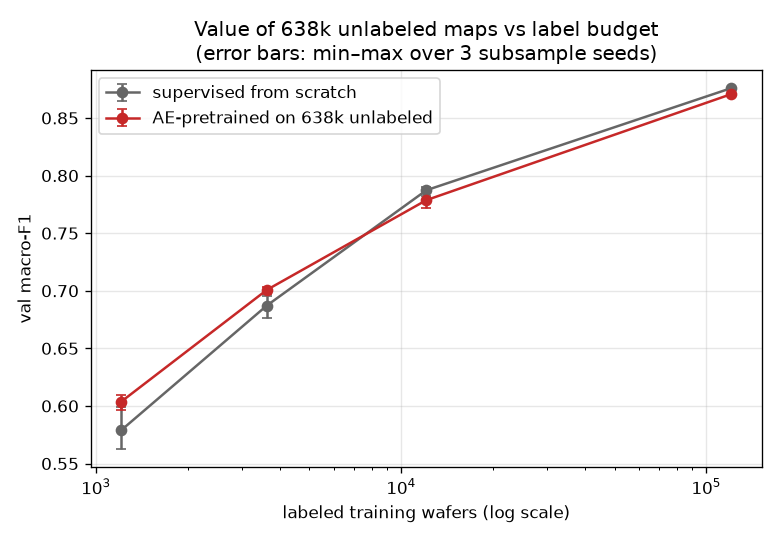

# wafertriage — Wafer-Map Defect Triage under Label Scarcity

This project builds a defect-pattern recognition system for real fab wafer maps,
and then goes one step further than most: it turns the model's predictions into
actual dispositions with costs attached.

The result is not "replace human inspection with AI." The result is **"use AI to
decide where human inspection is most valuable."** The proposed pilot therefore
keeps human review in the loop, while using the model to prioritize attention
and adapt the threshold to the actual cost of missed defects.

## Headline result

Pricing a missed systematic defect at 100× the cost of one manual review, on a
test split of 25,801 wafers that was kept sealed until the very end and
evaluated exactly once:

| Policy | Auto-cleared | Missed among cleared | Cost vs full manual review |
|---|---|---|---|
| **Three-way triage (this work)** | **62.7%** | **7 (0.043%)** | **−28.5%** |
| Full manual review | 0% | — | baseline |

The conclusion is not fragile to the cost assumption. Across every setting
tested (missed-defect cost from 10× to 1,000× a review), the triage policy is
never worse than full manual review — when misses get more expensive, the
policy automatically tightens its own thresholds and buys safety with more
human review, reaching zero observed misses at the most conservative setting.

One honest detail worth spelling out: on the validation split the policy showed
*zero* misses, and that zero did not survive the test set (7 misses, slightly
above the statistical upper bound implied by validation). This is what mild
overfitting-to-validation looks like in practice, and it is exactly why the
test set was kept sealed: the numbers above are the ones to trust.

## When is unlabeled data worth anything?

The dataset contains 811,457 wafer maps, but only about 3% carry expert defect
labels. A natural hope is that the 638K unlabeled maps can help. The honest
answer turned out to be: **it depends on how many labels you have.**



With plenty of labels, pretraining on the unlabeled maps adds nothing. Below a
crossover of roughly 5–10K labels, it starts to pay, and the payoff grows as
labels get scarcer: +2.5 points of macro-F1 with only 1.2K labels, consistent
across all three random subsamples. In other words, this technique belongs to
the cold-start phase of a new line, not to everyday operation. Before reaching
this answer, two pseudo-labeling approaches failed in an instructive way — the
model fed its own biased guesses back to itself until they collapsed. The full
post-mortem lives in [`results/experiments.md`](results/experiments.md).

## Why the accuracy numbers look "low"

Published benchmarks on this dataset often report 96–98% accuracy using random
train/test splits. But wafers from the same lot are near-duplicates, so random
splits let the model recognize *lots* rather than *defect patterns*, and the
scores come out inflated. This project splits by lot instead, which produces
honest and therefore lower numbers: the supervised reference reaches macro-F1
0.876. Plain accuracy would read 97.7%, but that mostly reflects the 85%
majority class, which is why per-class metrics and cost-based evaluation are
used throughout.

## What's in here

| Path | What it does |
|---|---|
| `src/prepare_wm811k.py` | Raw pickle → HDF5 (handles the 2017-era pickle's quirks) |
| `src/make_splits.py` | Lot-based train/val/test splits with class-coverage checks |
| `src/dataset.py` | Two-channel encoding, 64×64 resize, rotation/flip augmentation |
| `src/model.py` | 288K-parameter CNN |
| `src/train_baseline.py` | Supervised training, class-weighting options, label-budget subsampling |
| `src/train_semi.py` | The semi-supervised attempts (kept as documented failures) |
| `src/train_ae.py` | Autoencoder pretraining on the unlabeled maps |
| `src/calibration.py` | Reliability diagram and calibration error |
| `src/policy.py` | Triage thresholds in closed form, policy evaluation across the cost sweep |
| `src/allocate.py` | Which wafers to review when reviewer time is limited (a small MIP) |
| `results/experiments.md` | Every run, with its full reproduction command |
| `report/factsheet.md` | Single source of truth for every number cited anywhere |
| `report/writeup.md` | Two-page technical report — the full story, final test numbers included |
| `report/memo.md` | One-page pilot memo for a non-technical decision-maker (Chinese) |

## Quickstart

```bash
uv sync                                  # exact environment from uv.lock
# download LSWMD.pkl (WM-811K) into data/raw/ — see prepare_wm811k.py docstring
uv run python src/prepare_wm811k.py      # one-time conversion to HDF5
uv run python src/make_splits.py         # lot-based splits
uv run python src/train_baseline.py --weights sqrt --run weighted_sqrt
uv run python src/policy.py              # triage evaluation
```

Seeds are fixed everywhere, and every experiment in `results/experiments.md`
lists the exact command that produced it.

## Honest limitations

All cost parameters are stated assumptions, measured in units of one manual
review; no real fab cost data was available. The measured miss rate at the
working setting (0.043%, 7 wafers) comes from a single one-shot test
evaluation, so its exact value carries sampling uncertainty — treat it as
"a few per ten thousand," not as a precise constant. The cost model also
assumes human reviewers make no mistakes. Finally, everything was evaluated on
a single dataset at a single model scale, and the distribution gap between
labeled and unlabeled wafers — the likely culprit behind the pseudo-labeling
failures — was diagnosed but not directly tested.

## Provenance

Developed with AI assistance (Claude). All design decisions, experimental
choices, analysis, and interpretation are my own, and I can defend any of them.

Data: WM-811K (LSWMD), originally from MIR Lab; see `src/prepare_wm811k.py`
for sourcing notes. License: MIT.
